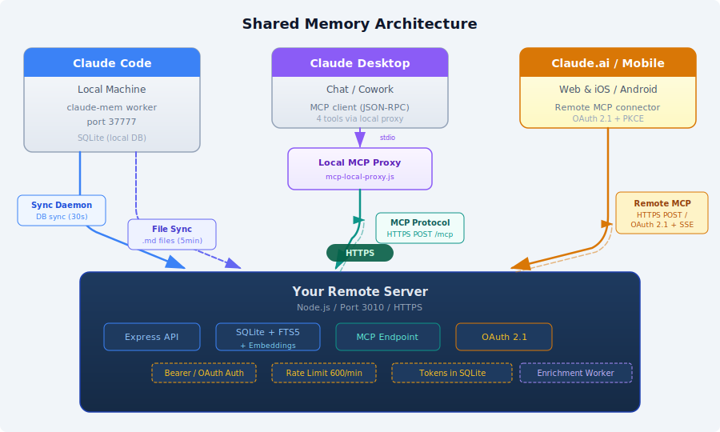

# claude-bridge

A shared remote memory server that enables **Claude Code**, **Claude Desktop**, **Claude.ai**, and the **Claude mobile app** to share persistent memory and context across sessions. The primary use case is **brainstorm-then-execute**: plan and ideate in any Claude client, then open Claude Code and immediately access those plans for execution.

Claude Code sessions generate observations, session summaries, and user prompts locally. A sync daemon pushes these records to a remote server. All Claude clients connect via MCP — Claude.ai and mobile connect directly via OAuth 2.1 (remote MCP connector), while Desktop and Code connect via a local MCP proxy.



## Quick Start

### Prerequisites

- Node.js 20+
- Docker (for deployment)
- A Linux server with a public domain (for remote hosting)
- [claude-mem](https://github.com/thedotmack/claude-mem) running locally (produces the local SQLite database)

### 1. Install dependencies

```bash
npm install
```

### 2. Run locally (development)

```bash
# Create a .env file from the example
cp .env.example .env
# Edit .env and set your API_KEY

# Start the server
DATABASE_URL=file:./data/memory.db API_KEY=your-secret-key npm run dev
```

### 3. Run tests

```bash
npm test
```

### 4. Deploy to a remote server

```bash
# Set required env vars
export DEPLOY_HOST=YOUR_SERVER_IP
export DEPLOY_DOMAIN=example.com
export DEPLOY_KEY=~/.ssh/id_rsa

# Deploy
./deploy.sh
```

The deploy script will:
- Build a Docker image on the remote host
- Start the container with resource limits
- Configure Caddy reverse proxy for `memory.example.com`
- Print the generated API key

### 5. Configure the sync daemon (macOS)

Create the env file for the sync daemon:

```bash
mkdir -p ~/.claude-mem
cat > ~/.claude-mem/remote-sync-env << 'EOF'
CLAUDE_MEM_REMOTE_URL=https://memory.example.com
CLAUDE_MEM_REMOTE_API_KEY=your-api-key-from-deploy
CLAUDE_MEM_SYNC_PROJECT_ROOT=/path/to/your/project
EOF
```

Install the launchd daemon:

```bash
chmod +x sync/setup-sync-daemon.sh
./sync/setup-sync-daemon.sh
```

Or manually install the plist (see `sync/com.claude-mem-sync.plist.example`).

### 6. Configure Claude Desktop

Add to your Claude Desktop MCP config (`~/Library/Application Support/Claude/claude_desktop_config.json`):

```json
{
  "mcpServers": {
    "memory": {
      "command": "node",
      "args": ["/path/to/claude-bridge/sync/mcp-local-proxy.js"]
    }
  }
}
```

The MCP proxy reads credentials from `~/.claude-mem/remote-sync-env` and exposes 4 tools to Claude Desktop: `search`, `timeline`, `get_observations`, and `save_memory`.

### 7. Configure Claude Code (optional)

To access Desktop-saved memories from Claude Code, add the same proxy as an MCP server in `~/.claude/settings.json`:

```json
{
  "mcpServers": {
    "remote-memory": {
      "command": "node",
      "args": ["/path/to/claude-bridge/sync/mcp-local-proxy.js"]
    }
  }
}
```

This enables the **brainstorm-then-execute** workflow: plan in Desktop, then open Claude Code and search for the plan to start implementing. Claude Code gets 4 tools prefixed as `mcp__remote-memory__*`.

## Claude.ai Connector (Remote MCP)

Claude-bridge includes a built-in OAuth 2.1 provider so Claude.ai can connect as a remote MCP server.

### Setup

1. Set the OAuth password in your deploy environment:
   ```bash
   # Add to your deploy env file (or export directly)
   export DEPLOY_OAUTH_PASSWORD=your-chosen-password
   ```

2. Deploy (or redeploy) claude-bridge:
   ```bash
   ./deploy.sh --host $DEPLOY_HOST --key $DEPLOY_KEY
   ```

3. The deploy script prints your OAuth credentials:
   ```
   ==> OAuth Client ID: <generated>
   ==> OAuth Client Secret: <generated>
   ```

4. In Claude.ai, go to Settings → Connectors → Add Connector:
   - **Server URL:** `https://memory.yourdomain.com`
   - **Client ID:** (from step 3)
   - **Client Secret:** (from step 3)

5. Claude.ai will open your browser to the authorize page. Enter your password and click "Grant Access".

6. Done — Claude.ai can now search your memory, save plans, and access your development context.

### How it works

Claude-bridge implements OAuth 2.1 Authorization Code + PKCE:
- `/.well-known/oauth-protected-resource` and `/.well-known/oauth-authorization-server` for discovery
- `/authorize` — password-gated consent page
- `/token` — exchanges auth codes for Bearer tokens

Tokens are persisted in SQLite (same database, Docker volume-mounted) and survive server restarts and redeployments. The existing API key auth for the sync daemon and Claude Code continues to work unchanged.

### Security

- Password brute-force protection (10 req/min on `/authorize`)
- PKCE (S256) prevents authorization code interception
- Redirect URI validation (only `claude.ai` and `localhost` allowed)
- Timing-safe password comparison
- Tokens expire: access tokens 24h, refresh tokens 30d

## What Gets Synced (and What Doesn't)

| Source | Sync method | Automatic? |
|--------|------------|------------|
| Claude Code observations, sessions, prompts | Sync daemon pushes to remote every 30s | **Yes** — all Code sessions are captured automatically |
| Project `.md` files | Sync daemon uploads every 5 min | **Yes** — file changes detected and synced |
| Claude Desktop chats | `save_memory` MCP tool | **No** — must be explicitly saved |

**Important:** Claude Desktop conversations are not synced automatically. Nothing is saved to the remote server unless `save_memory` is called. However, old conversations are still on Claude's servers — you can open any previous chat and ask Claude to save the key points via `save_memory` to backfill.

To make saving automatic within Desktop sessions, add this to your Claude Desktop system prompt (Settings → System Prompt):

> At the end of every planning or brainstorming session, use the save_memory tool with structured fields (title, summary, decisions, requirements, plan, open_questions) to persist the conclusions. Do not save the conversation — save the distilled output.

This ensures every Desktop brainstorming session produces a structured memory that Claude Code can retrieve later.

## Configuration Reference

### Remote Server Environment Variables

| Variable | Description | Default |
|----------|-------------|---------|
| `DATABASE_URL` | SQLite path, e.g. `file:/app/data/memory.db` | Required |
| `API_KEY` | Bearer token for API authentication | Required |
| `OAUTH_CLIENT_ID` | OAuth client ID for Claude.ai connector | Optional (auto-generated on deploy) |
| `OAUTH_CLIENT_SECRET` | OAuth client secret for Claude.ai connector | Optional (auto-generated on deploy) |
| `OAUTH_PASSWORD` | Password for OAuth authorize page | Optional (enables Claude.ai connector) |
| `PORT` | Server listen port | `3010` |
| `NODE_ENV` | Environment mode | `production` |
| `EMBEDDING_PROVIDER` | Embedding provider: `openai` or `noop` | `noop` (keyword search only) |
| `EMBEDDING_MODEL` | Embedding model name | `text-embedding-3-small` |
| `EMBEDDING_API_KEY` | API key for embedding provider | Optional |
| `EMBEDDING_DIMENSIONS` | Vector dimensions | `1536` |
| `ABSTRACT_MODEL` | Model for generating one-line abstracts | `gpt-4.1-mini` |

### Local Sync Daemon Environment Variables

Set in `~/.claude-mem/remote-sync-env`:

| Variable | Description |
|----------|-------------|
| `CLAUDE_MEM_REMOTE_URL` | Remote server URL, e.g. `https://memory.example.com` |
| `CLAUDE_MEM_REMOTE_API_KEY` | API key from deployment |
| `CLAUDE_MEM_SYNC_PROJECT_ROOT` | Absolute path to your project root (for .md file sync) |

### Deploy Script Environment Variables

| Variable | Description | Default |
|----------|-------------|---------|
| `DEPLOY_HOST` | Remote server IP or hostname | Required |
| `DEPLOY_DOMAIN` | Base domain for subdomain routing | `example.com` |
| `DEPLOY_KEY` | Path to SSH private key | `~/.ssh/id_rsa` |
| `DEPLOY_OAUTH_PASSWORD` | OAuth password for Claude.ai connector | Optional |
| `DEPLOY_OPENAI_API_KEY` | OpenAI API key for embeddings + abstracts | Optional |

## API Reference

### Public Endpoints

| Method | Path | Description |
|--------|------|-------------|
| `GET` | `/api/health` | Health check (no auth required) |
| `GET` | `/.well-known/oauth-protected-resource` | OAuth protected resource metadata (RFC 9728) |
| `GET` | `/.well-known/oauth-authorization-server` | OAuth authorization server metadata (RFC 8414) |
| `GET` | `/authorize` | OAuth consent form |
| `POST` | `/authorize` | Password validation + auth code issue |
| `POST` | `/token` | Token exchange (auth code or refresh) |

### Authenticated Endpoints

All require `Authorization: Bearer <API_KEY>` header. Rate limited to 600 req/min.

| Method | Path | Description |
|--------|------|-------------|
| `POST` | `/api/observations` | Create an observation |
| `POST` | `/api/sessions` | Create a session summary |
| `POST` | `/api/prompts` | Create a user prompt |
| `POST` | `/api/observations/batch` | Batch fetch observations by ID array |
| `GET` | `/api/search` | Search with `mode=keyword\|semantic\|hybrid`. Filters: `query` (required), `obs_type`, `source`, `after`, `before`, `project`, `limit`, `offset` |
| `POST` | `/api/admin/backfill` | Enqueue all records for embedding + abstract generation |
| `GET` | `/api/timeline` | Chronological timeline with anchor navigation |
| `GET` | `/api/context` | Markdown context dump for projects |
| `POST` | `/mcp` | MCP JSON-RPC 2.0 endpoint (legacy path) |
| `POST` | `/` | MCP JSON-RPC 2.0 endpoint (used by Claude.ai connector) |

### MCP Tools (via Claude Desktop or Claude Code)

| Tool | Description |
|------|-------------|
| `search` | Search across observations and sessions. Supports `mode`: `keyword` (FTS5), `semantic` (embedding similarity), `hybrid` (both, merged via RRF, default). Structured filters: `obs_type`, `source`, `after`/`before` (ISO 8601 or relative like `7d`). Filters compose with AND. |
| `timeline` | Chronological timeline with anchor-based navigation |
| `get_observations` | Batch fetch observations by ID (structured plans get semantic field names) |
| `save_memory` | Save a memory — simple text or structured (summary, decisions, plan, etc.) |

#### Structured Saves

The `save_memory` tool supports two modes. **Simple mode** for quick notes:

```json
{ "text": "The auth service uses RS256 for JWT signing" }
```

**Structured mode** for brainstorming sessions, plans, and roadmaps — saves each field into a separate FTS-indexed column for targeted search and token-efficient retrieval:

```json
{
  "title": "Meal Planner App Architecture",
  "summary": "Decided on Next.js + Supabase stack with grocery API integration",
  "decisions": "- Use Spoonacular API for recipe data\n- Supabase for auth + DB",
  "requirements": "- Must support dietary restrictions\n- Offline-capable PWA",
  "plan": "1. Scaffold Next.js + Supabase\n2. Integrate recipe API\n3. Build calendar UI",
  "open_questions": "- Which grocery store APIs are available?",
  "project": "meal-planner"
}
```

Simple mode requires `text`. Structured mode requires `title` + `summary`. All other structured fields are optional. See [docs/ARCHITECTURE.md](docs/ARCHITECTURE.md#structured-saves) for full field reference and storage details.

## Hybrid Search (Keyword + Semantic)

claude-bridge supports three search modes via the `mode` parameter on both the REST API and MCP `search` tool:

| Mode | Behavior | Latency | Requires API Key |
|------|----------|---------|-----------------|
| `keyword` (default) | FTS5 full-text search | <5ms | No |
| `semantic` | Embedding cosine similarity | 200-400ms | Yes |
| `hybrid` | FTS5 + embeddings merged via Reciprocal Rank Fusion | 200-400ms | Yes |

**Without an embedding provider configured**, the server runs keyword-only. Semantic/hybrid modes return an error message. This is the zero-config default.

### Enabling Semantic Search

Set the embedding environment variables and redeploy:

```bash
EMBEDDING_PROVIDER=openai
EMBEDDING_MODEL=text-embedding-3-small
EMBEDDING_API_KEY=sk-...
```

Then backfill existing records:

```bash
curl -X POST https://memory.example.com/api/admin/backfill \
  -H "Authorization: Bearer $API_KEY"
```

The background enrichment worker processes records asynchronously — 20 per batch every 5 seconds. New records are automatically enqueued on write.

### Abstracts

When an embedding provider is configured, the server also generates one-line abstracts for each observation and session using a chat model (`ABSTRACT_MODEL`, default `gpt-4.1-mini`). These appear in search results as the `abstract` field, allowing Claude to triage results without fetching full content via `get_observations`.

### Performance Results (2026-03-22)

Evaluated against 20 ground-truth queries across 3 categories with 2,052 observations:

| Category | Keyword R@10 | Hybrid R@10 | Improvement |
|----------|-------------|-------------|-------------|
| A: Keyword-friendly | 0.22 | **0.51** | +132% |
| B: Synonym/paraphrase | 0.10 | **0.19** | +90% |
| C: Conceptual/intent | 0.00 | **0.10** | from zero |

Semantic search finds results that keyword search completely misses — e.g., "user experience delays frustrating" now surfaces performance bottleneck observations (MRR 0.00 → 1.00).

### Eval Harness

The `eval/` directory contains scripts for measuring retrieval quality:

```bash
# Baseline keyword eval
CLAUDE_MEM_REMOTE_URL=https://memory.example.com \
CLAUDE_MEM_REMOTE_API_KEY=... \
node eval/retrieval-eval.js --mode=keyword

# All modes comparison
node eval/retrieval-eval.js --mode=all

# Latency benchmark (p50/p95/p99)
node eval/latency-bench.js
```

## How the Sync Daemon Works

The sync daemon (`sync/push-to-remote.js`) runs as a macOS launchd service:

1. Opens the local claude-mem SQLite database (`~/.claude-mem/claude-mem.db`) in read-only mode
2. Tracks sync progress in `~/.claude-mem/remote-sync-state.json` (last synced ID per table)
3. Every 30 seconds, queries for new records and POSTs them to the remote API
4. Handles duplicates gracefully (409 Conflict = already synced)
5. Every 5 minutes, scans for new/changed `.md` files in `CLAUDE_MEM_SYNC_PROJECT_ROOT` and uploads them as reference observations

### Sync Daemon Setup

**Option A: Automated** (recommended)
```bash
./sync/setup-sync-daemon.sh
```

**Option B: Manual**
1. Copy `sync/com.claude-mem-sync.plist.example` to `~/Library/LaunchAgents/com.claude-mem-sync.plist`
2. Edit the paths (node binary, script path, log path)
3. Run: `launchctl load ~/Library/LaunchAgents/com.claude-mem-sync.plist`

### Viewing Logs

```bash
tail -f ~/.claude-mem/logs/sync.log
```

### Stopping the Daemon

```bash
launchctl unload ~/Library/LaunchAgents/com.claude-mem-sync.plist
```

## Project Structure

```
.
├── server/                  # Remote server (Express + SQLite)
│   ├── index.js             # App entry point, env parsing, worker init
│   ├── db.js                # Database setup + migrations (v1-v3)
│   ├── mcp.js               # MCP JSON-RPC 2.0 endpoint (async)
│   ├── oauth.js             # OAuth 2.1 provider (Claude.ai connector)
│   ├── embeddings.js         # Embedding provider abstraction (OpenAI, Noop)
│   ├── abstracts.js          # Abstract generator (one-line summaries)
│   ├── enrichment-worker.js  # Background queue for embeddings + abstracts
│   ├── search-semantic.js    # Cosine similarity, RRF merge, semantic search
│   ├── search-filters.js    # Structured filter parsing (obs_type, source, after, before)
│   ├── middleware/auth.js    # Bearer token + OAuth token auth
│   └── routes/
│       ├── search.js         # GET /api/search (keyword/semantic/hybrid)
│       ├── admin.js          # POST /api/admin/backfill
│       ├── observations.js   # POST /api/observations (enqueues enrichment)
│       ├── sessions.js       # POST /api/sessions (enqueues enrichment)
│       └── ...
├── sync/                    # Local sync tools
│   ├── push-to-remote.js    # Sync daemon (launchd service)
│   ├── mcp-local-proxy.js   # MCP stdio proxy for Claude Desktop
│   ├── setup-sync-daemon.sh # Auto-generates and installs launchd plist
│   └── com.claude-mem-sync.plist.example
├── test/                    # Test suite (node:test, 113 tests)
├── eval/                    # Retrieval quality evaluation
│   ├── retrieval-eval.js    # Ground-truth query set, Recall@K, MRR, Precision@K
│   └── latency-bench.js     # Keyword search p50/p95/p99 latency benchmark
├── docs/                    # Architecture docs + diagrams
├── Dockerfile               # Production container
├── deploy.sh                # Deploy to remote server
├── remove.sh                # Remove from remote server
├── deploy.config.json       # Deployment configuration
├── .env.example             # Environment variable template
└── package.json
```

## License

MIT
